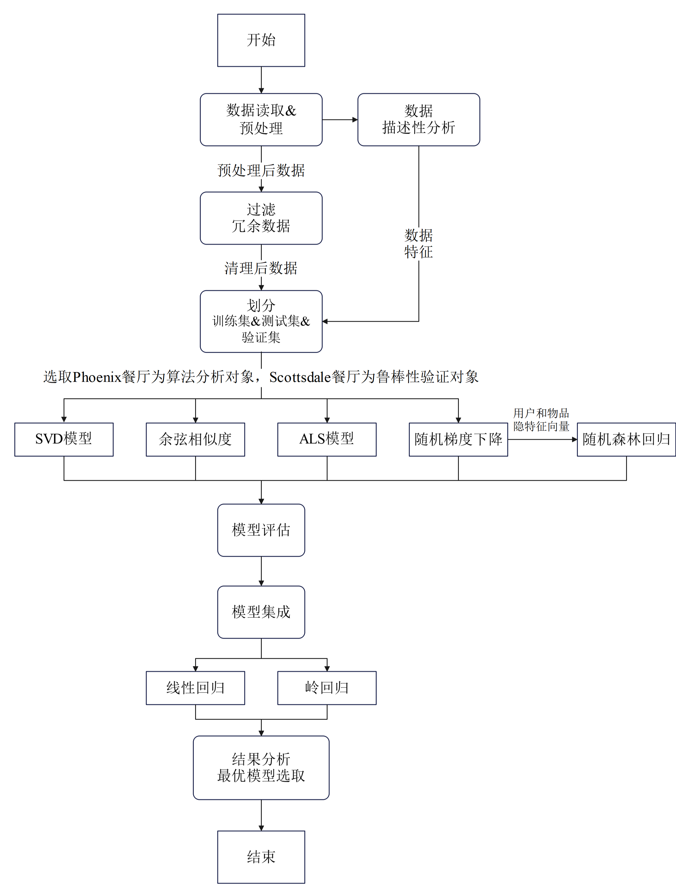

# 摘要

简要介绍论文研究目的、存在问题、使用算法、结果和结论，语言力求精炼。（300-500字） 

**关键词： 5个**

# 概述

（说明研究背景及选题意义，即选题的重要性及必要性，可以从学术价值或/及产业价值的视角分析选题依据，总结现有研究及应用中的研究空白或管理痛点，归纳出主要研究问题及研究意义等）

# 研究与应用现状分析

## 推荐系统的基本原理

推荐系统通过连接用户与他们感兴趣和偏好的项目，实现为用户精准提供满足其个性化需求的信息。现如今，推荐系统已广泛应用于包括大众点评等评分网站的餐厅推荐和电子商务平台如淘宝、抖音电商的商品推荐。协同过滤是一种被证实为成功且广泛使用的推荐技术，其基于假设：具有相似兴趣的用户在未来也会保持共同的兴趣。 【`Goldberg D, Nichols D, Oki BM, Terry D. Using collaborative filtering to weave an information tapestry.[J]. Communications of the ACM, 1992, 35(12): 61-70. DOI: 10.1145/138859.138867`】近年来，通过利用“用户-物品”的U-I矩阵，协同过滤显著提升了推荐系统的性能，其核心任务是：对于特定的目标用户 $u$ ，推荐最符合 $u$ 可能喜好的物品 $i$ 。【`Jin R, Chai J Y, Si L. An Automatic Weighting Scheme for Col- laborative Filtering[C]. *The 27th annual international ACM SIGIR conference on Research and development in information retrieval*, 2004: 337-344.` `Linden G, Smith B, York J. Amazon.com Recommendations: Item-to-Item Collaborative Filtering[J]. *IEEE Internet Computing*, 2003, 7(1): 76-80.`】其中，物品与用户的匹配程度（即用户对物品的偏好程度）是推荐算法计算的核心目标，可以用给定 $u$ 后发现候选物品 $i$ 的条件概率 $P(i|u)$​ 来量化。因此，推荐系统的任务目标可以用以下公式【`XIAO Yanghua. Knowledge Graph – Concepts and Techniques[M]. BEIJING: Publishing House of Electronics Industry, 2019. (肖仰华. 知识图谱-概念与技术[M]. 北京: 电子工业出版社, 2019.)`】来表示：

$$
i_{0}=\operatorname*{\arg max}_{i\in I}P(i/u)
$$
其中的 $I$ 是所有候选物品的集合。在许多推荐模型中， $P(i|u)$ 常用 $\hat{y}_{ui}$ 表示，这表明该条件概率度量的是 $u$ 与 $i$ 的匹配程度（分值）。公式 1 显示系统要推荐给用户的是匹配概率值最大的物品 $i_0$ 。如果系统要为用户推荐一组物品（也称为列表式推荐），则可对所有候选物品按概率值排序，将排序前 $n$ 位的物品作为输出。在传统的协同过滤推荐算法的推荐系统中 $P(i|u)$ 的计算往往来自用户与物品的历史交互记录（如评分、点击或购买记录）。用户-物品交互记录又可以分为显式反馈和隐式反馈两类。显式反馈包括用户对物品的具体评分（评级），因为可以从中明确看出用户对物品的偏好程度。不少推荐算法是对没有观察到交互记录的“用户-物品”对预测其可能的匹配分值 $r$ （即用户对物品的评分），包括许多基于矩阵分解的推荐算法，【`Zhou G R, Zhu X Q, Song C R, et al. Deep Interest Network for Click-through Rate Prediction[C]. *The 24th ACM SIGKDD Inter- national Conference on Knowledge Discovery & Data Mining*, 2018: 1059-1068.`】这种任务通常也称为评分预测。这类推荐算法的目标可以视为学习以下中的用户-物品交互函数 $f$ ：
$$
R = f(U \times I)
$$
其中， $U$ 和 $I$ 分别代表系统中所有用户与物品的集合， $R$​​​ 则是所有用户-物品对的匹配分值集合。

## 推荐系统面临的挑战

随着个性化推荐的实际场景愈发多样复杂，用户的要求也日渐提高，推荐系统面临的挑战越来越多，其中包括：

1. 数据稀疏性问题。在许多情况下，推荐系统因数据稀疏而难以达到满意的推荐效果。例如，在用户与物品的历史交互数据不足的情况下，基于用户和物品的交互记录来计算匹配值的传统协同过滤算法无法准确预测用户与物品间的相关性，导致无法生成精确的推荐结果。这种问题在新用户或新商品上尤为突出，关于完全没有任何交互记录的用户/物品的推荐常被称为冷启动(cold-start) 推荐问题。

2. 推荐结果同质化。推荐系统常基于用户过去的交互行为推荐相似物品，选择与用户之前交互物品的相似物品来推荐。虽然这种方法在一定程度上确保了推荐的相关性和准确性，但也可能导致推荐结果的同质化，即所谓“信息茧房”效应。例如，一个购买过高端智能手机的用户可能会被推荐另一款高端手机，但这种推荐忽略了用户短期内可能不需要再购买新手机，或者用户对某品牌的忠诚度很高，不愿尝试竞争品牌。所以对这位用户而言，该推荐结果缺乏商业价值，甚至可能引起用户的反感。

3. 推荐结果缺乏可解释性。虽然基于协同过滤的推荐算法能够挖掘用户群体中的共同偏好，但这种基于群体行为的推荐并不一定符合每个个体的独特选择。此外，如基于矩阵分解的隐因子模型虽然能有效地捕捉用户和物品之间的潜在关系，但这些隐因子本身往往缺乏明确的物理意义，难以解释每个因子所代表的具体属性或偏好。近年来，虽然深度学习模型在推荐系统中表现出色，但它们的“黑箱”特性，即内部计算过程的不透明和难以解释，也是一个不容忽视的问题。

## 本文的研究贡献与创新点

传统推荐系统中，数据稀疏性问题尤为显著，尤其是对新用户或新商品的推荐，常见的协同过滤算法往往因为缺乏足够的用户与物品交互数据而难以预测精确结果。为了解决数据稀疏性和冷启动问题，本文通过采用ALS和SGD算法优化稀疏矩阵的处理，提高了这些情况下的推荐质量。ALS算法通过交替固定用户和物品的特征向量来解决线性方程组，有效填补了评分矩阵的缺失值；而SGD算法则通过随机梯度下降迭代优化损失函数，提高了处理大规模数据的效率和精度。

推荐系统倾向于基于用户过往的交互行为推荐类似物品，这虽然能确保推荐的相关性和准确性，但也可能导致推荐结果的同质化。本文通过集成多种推荐算法，包括SVD、余弦相似性、随机森林回归等，组合它们的预测结果，以达到互补效应，提供更加多样化的推荐，减少推荐结果的同质化问题。多算法集成能够使模型扩展推荐系统的覆盖范围，也能够增强推荐内容的多样性，减少了信息泡泡效应。

针对推荐结果常见的缺乏可解释性问题，本文特别利用随机森林回归器处理矩阵补全问题，并通过探索用户与物品隐向量的非线性关系来预测评分。随机森林不仅因其优秀的非线性学习能力而提高了评分预测的准确性，更因其能够提供决策树中特征的重要性评分，从而增加了推荐系统决策过程的透明度和可解释性。

为了整理论文中使用的符号变量，并确保一致性，我们将以下列表化出每个符号及其含义：

| 符号                | 符号含义                                                     |
| ------------------- | ------------------------------------------------------------ |
| $ u $               | 目标用户                                                     |
| $ i $               | 目标物品                                                     |
| $ I $               | 所有候选物品的集合                                           |
| $ P(i|u) $          | 给定用户 $ u $ 后发现候选物品 $ i $ 的条件概率               |
| $ \hat{y}_{ui} $    | 用户 $ u $ 与物品 $ i $ 的匹配程度（分值）                   |
| $ R $               | 用户-物品交互函数                                            |
| $ U $               | 系统中所有用户的集合                                         |
| $ M $               | 用户的总数                                                   |
| $ N $               | 项目的总数                                                   |
| $ R_{ij} $          | 用户 $ i $ 对项目 $ j $ 的评分，表示用户偏好                 |
| $ \hat{R}_{ij} $    | 用户 $ i $ 对项目 $ j $ 的预测评分                           |
| $ Z_i $             | 用户 $ i $ 的 $ K $ 个邻近用户的集合                         |
| $ \text{sim}(i,k) $ | 用户 $ i $ 和用户 $ k $ 之间的相似性度量                     |
| $ f $               | 基于模型的协同过滤中用来从已知数据 $ R $ 估计模型参数 $ p $ 和 $ q $ 的函数 |
| $ p_i $             | 用户 $ i $ 的一组模型参数                                    |
| $ q_j $             | 项目 $ j $ 的一组模型参数                                    |
| $ U^{*} $           | 最优的用户潜在因子矩阵                                       |
| $ V^{*} $           | 最优的项目潜在因子矩阵                                       |
| $ \lambda_U $       | 用户因子的正则化参数                                         |
| $ \lambda_V $       | 项目因子的正则化参数                                         |
| $ I_{ij} $          | 指示函数，如果用户 $ i $ 对项目 $ j $ 有评分则为1，否则为0   |

## 基于记忆的协同过滤方法

基于记忆的协同过滤方法分为基于用户的或基于物品的。在给定 U-I 评分矩阵的情况下，典型的基于用户的协同过滤方法通过聚合几个相似用户之前对该项目的评分来预测用户对目标项目的评分。通过使用如皮尔逊相关性或余弦相似性的相似性度量，应用于包含特定用户分配给收集中项目的评分的评分向量，来识别相似用户。通常，选择最近邻K个用户，即与给定用户相似度最高的K个用户，并聚合他们对目标项目的评分，以生成对该用户在该项目上的预测评分。我们可以如下公式化用户$i$对项目$j$的预测评分：
$$
\hat{R}_{ij} = \frac{1}{C}\sum_{k\in Z_i} \text{sim}(i,k) R_{kj},
$$

其中 $Z_i$ 是用户 $i$ 的 $K$ 个邻近用户的集合，$C$ 是一个归一化常数，$\text{sim}(i,k)$ 指定了用户 $i$ 和用户 $k$ 之间的相似性（根据预定义的相似性度量）。计算出的相似性代表基于记忆的CF的关键特性。它们构成了系统的“记忆”，用于产生后续的推荐。注意，等式是表示基于用户的CF的最简单形式，许多调整可以应用，如Adomavicius 和 Tuzhilin报告的那样。

1. 

# 传统协同过滤的背景

在标准的CF设置中，我们有一组用户（例如，*M* 个用户）和一组项目（例如，*N* 个项目）。用户对单个项目的偏好可以由U-I矩阵 *R* 表示，在这个矩阵中，*R**ij* 的值表示用户 *i* 对项目 *j* 的偏好，如果 *R**ij* > 0。用户偏好可以直接表示，例如通过评分，或间接使用表示用户是否点击、查看或购买项目的二进制值表示。注意，已知的用户对项目的偏好通常非常有限，这使得矩阵 *R* 通常是稀疏的。传统上，我们使用 *R**ij* =? 表示用户 *i* 对项目 *j* 的偏好未知的情况。在此设置下，CF问题可以定义为：*给定代表M个用户对N个项目的已知偏好的U-I矩阵R，为每个用户推荐一个按与用户兴趣相关性降序排列的项目列表。* 需要注意的是，具有已知偏好的项目不会被考虑推荐，假设用户不希望推荐她之前已经消费过的项目。例如，如表I所示，展示了四个用户对六个项目的评分的U-I矩阵。然后，CF方法是基于U-I矩阵为每个用户生成推荐（以未看过的电影的排名列表的形式），例如，电影 *盗梦空间*、*赎罪* 和 *007：大破天幕杀机* 需要按预测相关性的降序排列作为对Alice的推荐。

基于记忆的协同过滤方法分为基于用户的或基于项目的。在给定用户-物品（U-I）评分矩阵的情况下，典型的基于用户的协同过滤方法通过聚合几个相似用户之前对该项目的评分来预测用户对目标项目的评分。通过使用相似性度量（通常是皮尔逊相关性或余弦相似性），应用于包含特定用户分配给收集中项目的评分的评分向量，来识别相似用户。通常，选择最近邻K个用户 — 即与给定用户相似度最高的K个用户 — 并聚合他们对目标项目的评分，以生成对该用户在该项目上的预测评分。按照第2.1节的符号，我们可以如下公式化用户$i$对项目$j$的预测评分：

$$
\hat{R}_{ij} = \frac{1}{C}\sum_{k\in Z_i} \text{sim}(i,k) R_{kj},
$$

其中 $Z_i$ 是用户 $i$ 的 $K$ 个邻近用户的集合，$C$ 是一个归一化常数，$\text{sim}(i,k)$ 指定了用户 $i$ 和用户 $k$ 之间的相似性（根据预定义的相似性度量）。计算出的相似性代表基于记忆的CF的关键特性。它们构成了系统的“记忆”，用于产生后续的推荐。注意，等式是表示基于用户的CF的最简单形式，许多调整可以应用，如Adomavicius 和 Tuzhilin报告的那样。

扩展这一核心机制，提出了一些修改和增强以改进基于用户的CF，例如引入细粒度的邻居加权因子，利用递归的邻居寻找方案，以及基于用户偏好子谱的用户-用户相似性。

与基于用户的CF相反，基于项目的CF方法是基于用户之前评价过的其他项目的信息来推荐项目。为给定用户推荐的项目通过聚合每个候选项目与该用户评价过的项目之间的相似性来排名。项目相似性由相似性度量定义，通常是余弦相似性或调整后的余弦相似性，根据用户分配给每个项目的分数来表示每个项目的向量。类似于方程，我们也可以以最简单的形式公式化基于项目的CF：

$$
\hat{R}_{ij} = \frac{1}{C}\sum_{k\in Z_j} \text{sim}(j,k) R_{ik},
$$

其中 $Z_j$ 是项目 $j$ 的 $K$ 个邻近项目的集合，$C$ 是一个归一化常数，$\text{sim}(j,k)$ 指定了项目 $j$ 和项目 $k$ 之间的相似性（根据预定义的相似性度量）。

基于记忆的CF方法通常有两个缺点。首先，由于其二次时间复杂性，计算所有用户对或项目对之间的相似性是昂贵的。其次，推荐精度取决于采用的相似性度量，这通常基于用户或项目之间的次优关系。另一方面，传统基于记忆的CF范式为整合用户和项目的丰富侧面信息以精细化相似性提供了优雅的机会，这将在第4节进一步讨论。这种扩展可以帮助弥补前面提到的缺点。

基于模型的协同过滤方法基于使用用户-物品（U-I）矩阵全部或部分作为输入来训练出的预测模型。然后可以使用训练好的预测模型为个别用户生成推荐。在一个简单和通用的形式中，我们可以如下表示基于模型的协同过滤：

$$
f(p_i, q_j) \rightarrow R_{ij}, \quad i=1,2,\dots, M, \quad j=1,2,\dots, N,
$$

其中 $ p_i $ 和 $ q_j $ 分别表示用户 $ i $ 和项目 $ j $ 的一组模型参数。$ f $ 是一个函数，将模型参数映射到已知数据（例如，评分）。因此，基于模型的CF的任务是在函数 $ f $ 下从已知数据 $ R $ 估计模型参数 $ p $ 和 $ q $。传统基于模型的CF方法的例子包括贝叶斯网络模型，该模型模拟了项目之间的条件概率；潜在语义模型，将用户和项目聚类到围绕U-I交互的潜在类；以及混合模型，该模型模拟了每个志同道合的用户群体内项目的概率分布。最近，由于其在可扩展性和精确性方面的优势，矩阵分解（MF）技术引起了广泛关注。通常，MF模型从U-I矩阵中的信息学习用户和项目的低秩表示（也称为潜在因子），进一步用于预测用户和项目之间的新评分。为了便于阅读，我们在下面包括了最常见的MF公式，部分符号在第2.1节中已定义：

$$
U^{*}, V^{*} = \operatorname*{\arg\min}_{U,V}\left\{\frac{1}{2}\sum_{i=1}^{M}\sum_{j=1}^{N}I_{ij}(R_{ij}-U_i^T V_j)^2 + \frac{\lambda_U}{2}\|U\|_F^2 + \frac{\lambda_V}{2}\|V\|_F^2\right\},
$$

其中 $ U $ 和 $ V $ 是两个潜在因子矩阵，$ U_i $ 和 $ V_j $ 分别代表它们从最小化中获得的最优值。具体来说，$ U_i $ 是 $ U $ 的一个列向量，代表用户 $ i $ 的潜在因子。同样，$ V_j $ 代表项目 $ j $ 的潜在因子。$ I_{ij} $ 是一个指示函数，如果 $ R_{ij} $ > 0 则等于1，否则为0。$ \|U\|_F $ 表示矩阵的Frobenius范数，$ \lambda_U $ 和 $ \lambda_V $ 是通常设置用于减轻模型过拟合的正则化参数。MF也从概率角度公式化，即作为一个概率矩阵分解（PMF）问题。PMF框架模拟了给定观察到的评分的潜在因子的条件概率，并包括处理复杂性正则化的先验。特别是MF方法的基于模型的CF可以被扩展以将额外信息纳入推荐系统。在第4节中，我们将详细回顾这些扩展。

## 与使用算法相关的文献综述

# 总体方案设计

（对所解决的商业问题进行定义、分析痛点，把商业问题定义成一个多源数据融合问题/大数据分析问题，设计总体的大数据分析解决方案、对数据来源、数据描述、数据分析过程等进行说明）

## 商业问题定义

## 数据分析问题定义

## 总体方案设计

从全生命周期视角明确各阶段构成（流程图），说明各阶段的具体工作内容以及预期结果 

# 多源数据融合方案设计

（说明数据源、ETL过程、必要元数据、多维数据模型等项内容）

## 数据源说明

（说明数据来源及数据项定义）

，对ETL过程、以及（并）

## 数据仓库设计

（选择关系模式或星型模式中的一种作为数据模型，对数据仓库进行数据模型设计，设计相应的关系模式连接示意图或星型模式示意图，并说明各个数据表的名称、数据项、关键字、与其它数据表的连接关系、等项内容）

## ETL

（重点说明数据源中的数据项与数据仓库中的数据项间的映射关系、汇总及加载规范等）

## 多维数据视图及OLAP

（重点说明系统可以支持的多维数据分析内容，实现上述分析的多维数据模型及OLAP操作等）

# 数据分析方案设计

（对算法设计、数据集、分析结果的说明） 

## 算法设计

（说明所使用的算法的选择依据、工作原理、主要过程、（算法改进方法）、伪码等） 

## 数据集及实验环境说明

（说明数据集特征及数据分布等，例如样本量、训练集/测试集构成、属性描述、数值属性的均值/标准差等；说明实验环境及主要参数设置等） 

## 评价指标

（说明所使用评价指标及计算公式） 

## 模式分析及解释

（说明在数据集上运行算法得到的实验结果、并结合所选问题对所产生的模式进行解释，如果太多可选择主要的或最显著的模式进行解释） 

# 总结与展望

（例如总结主要研究工作、结论，分析所设计方案优缺点，局限性，未来研究方向等）

# 主要参考文献

（参考文献应是国内外正式发表的学术期刊/会议论文，不包括教科书、专著、学位论文等文献，英文文献不少于4篇，总参考文献不少于10篇，按规范列出，见附件1）

从所有可能的物品集合 $ I $ 中选择一个物品 $ i_0 $，使得该物品 $ i $ 被用户 $ u $ 选择的概率 $ P(i/u) $ 最大。简言之，目标是推荐用户最有可能喜欢或选择的物品。